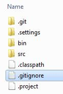

class: center, middle

# Introduction to Version control & Git (cli)

### MP 11/2015

---

# Contents

- Why version control?
- Basic principles of Version Control System
- Git on command line
- Basic usage & workflow
- Remote hosting services: Github, bitbucket
- Links to Learning materials
- Exercises

---

# Why to use VCS

_(Version Control System, revision control)_

- Compulsory tool for professional software development
- Track code changes
- What is changed since last version and before?
  - Why, comments
  - When did that happen?
  - Who did that?
- Share project code (and development history) —> Collaborate
- Backup??

- Example: [check revisions][wiki1] of an [Wikipedia article][wiki2]

[wiki1]: https://en.wikipedia.org/w/index.php?title=Git_(software)&action=history
[wiki2]: https://en.wikipedia.org/wiki/Git_(software)
<!-- Normal links including parentheses break links when rendered with remark. -->

---

# Basic concepts

- **Repository**: storage for all files and revision data
- **Checkout**: choosing specified version of code or development branch to work with
- **Clone**: taking a full copy of an existing repository
- **Commit**: saving a new revision of code and naming it (= adding a message/description) 
- **Tag**: special label for a revision (e.g. Release v. 1.1)
- **Branches**: parallel development versions of code
- **Merge**: combining changes of different branches together
- **Conflict**: occurs when there is different modifications in the same file while trying to merge branches 

---

# Git

- Development started By Linus Torvalds 2005
- Created for Linux kernel development
- Distributed System
- Can be used locally
-> remote server not mandatory

---

# Git tools

- Command line git (works directly in linux/mac terminal)
- Windows: [Git for windows](https://msysgit.github.io/) provides command line tools (git bash) and Graphic UI tools/integration to Windows explorer
- Git plugin for Eclipse: eclipse UI integration

---

# Git, basic usage/commands

- `git clone [url]`: clone an existing repository (creates a local copy of the repo)
- `git init`: create a new git repository
- `git add [filenames]`: choose files for the next commit (add to staging area)
- `git commit`: save a version of chosen files (needs a message)
- `git status`: check current status of the repo
- `git log`: show revision history
- `git branching [newBranchName]`: create a new branch based on current branch
- `git checkout [something]`: choose a branch or revision to work with
- `git push`: push the repository (new commits) to chosen remote repository
- `git pull`: pull the repository ( get new changes and commits) from remote repo
- `git diff`: shows the differences in files between working copy and the last commit

---

# Git Workflow

[Source](http://git-scm.com/book/en/v2/Getting-Started-Git-Basics)

---

# Git Revisions

- Git stores snapshots of all edited files in commits

[Source](http://git-scm.com/book/en/v2/Getting-Started-Git-Basics)

---

# Git ignore

Which files and changes should be tracked?

`.gitignore` file contents in Eclipse java projects (example):

Contents in project above:

    bin/
    .settings/
    .project
    .classpath

---

# [Github](https://github.com)

- **Github != git**
- Commercial service providing git remote server + project wiki, webpage hosting and wide user community 
- **Fork**: Create a new Github project, clone the git repository of an existing project and add repo to the new project 
- Almost _de facto_ hosting service for Open Source projects
- Repositories (projects) are public by default, private repos are not free (except student accounts)

- [Bitbucket](https://bitbucket.org) is another popular git repo hosting service providing free private repos for small teams

---

# Learn Git

Take a look at:

- Free book: [Pro Git](http://git-scm.com/book/en/v2)
- Free Codeschool course: [Try Git](https://www.codeschool.com/courses/try-git)
- [Atlassian Git Tutorials](https://www.atlassian.com/git/tutorials/)
- [GitHub Guides](https://guides.github.com/)

---

class: center, middle

# Exercises 

---

## Exercise 0: Try Git course

Optional but highly recommended short (15+ mins) online course at: https://www.codeschool.com/courses/try-git

(You need to create a free account to access the course)

---

## Exercise 1: Git command line basics

1. Install Git if missing command line tools, [instructions](https://git-scm.com/book/en/v2/Getting-Started-Installing-Git)
2. Create a local repo by **cloning** (`git clone`) this lecture material from Github: <https://github.com/mattpe/git-intro.git>
3. Create a remote repository at Bitbucket
4. Change the remote _origin_ to point to your Bitbucket repo (tip: `git remote help`)
  - remove existing _origin_
  - add new _origin_: url to your Bitbucket repo
5. Push the files to Bitbucket
6. Create a file `notes.md` in your local repo and record all git commands you have used into that file (check command: `history`)
7. Add the file to the local git repo
8. Commit your changes (remember to write a comment)
9. Push changes to remote repo
10. Update the file by adding new commands to list and _add, commit & push_ changes again

---

## Exercise 2: Collaboration & conflicts

1. Form a team of ~3 members 
2. Choose a Bitbucket repo of one of the members and add write permissions to other members of the team (every team member should be able to push to that repo)
3. all team members should clone the same remote repo
4. do individually at the same time as your team mates:
  - pull changes from remote repo
  - edit files locally
  - add & commit changes 
  - push to remote
  - resolve conflicts if needed, ([help](https://help.github.com/articles/resolving-a-merge-conflict-from-the-command-line/))
5. Go back to 4 (once at least)

---

## Returning exercises

Add read permission to your repos for user _mattpe_ on Bitbucket and return a link to your own and your team's repo to Tuubi. 

